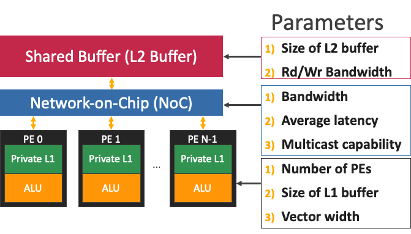
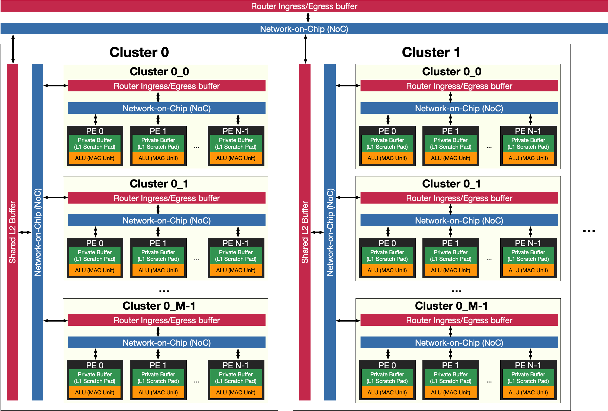

.. _Hardware Supported:

Hardware Supported
===================

MAESTRO supports a wide range of accelerators that consist of global shared scratchpad (i.e., L2 scratchapd), local PE scratchpad (i.e., L1 scratchpad), NoC, and a PE array organized into an arbitrary level of hierarchies or dimensionalities.

Hardware configuration can be defined using hardware parameters above and cluster directives and their size in mapping descriptions.

MAESTRO supports any level of hierarchies but only supports uniform clusters (e.g., MAESTRO cannot support an accelerator with a 2D PE array that has irregular number of PEs in each row).
