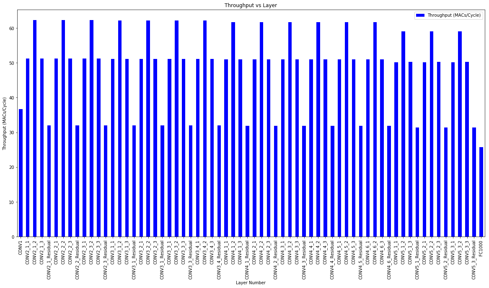
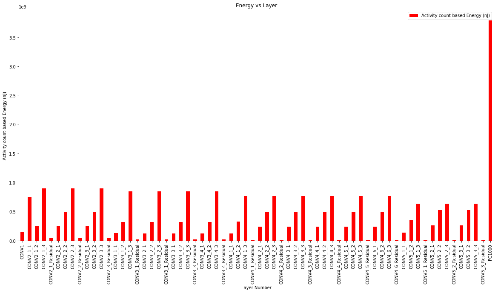
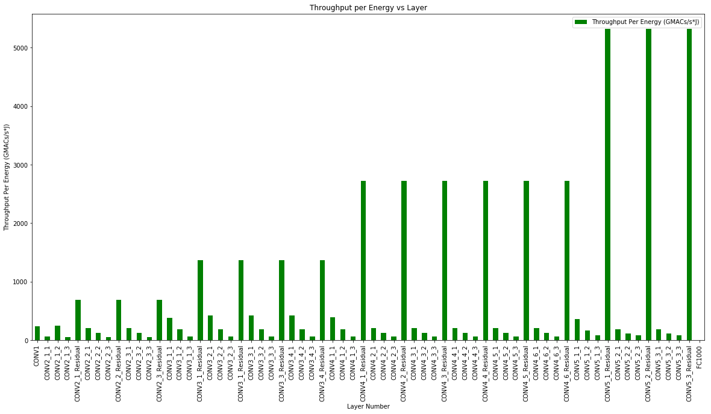
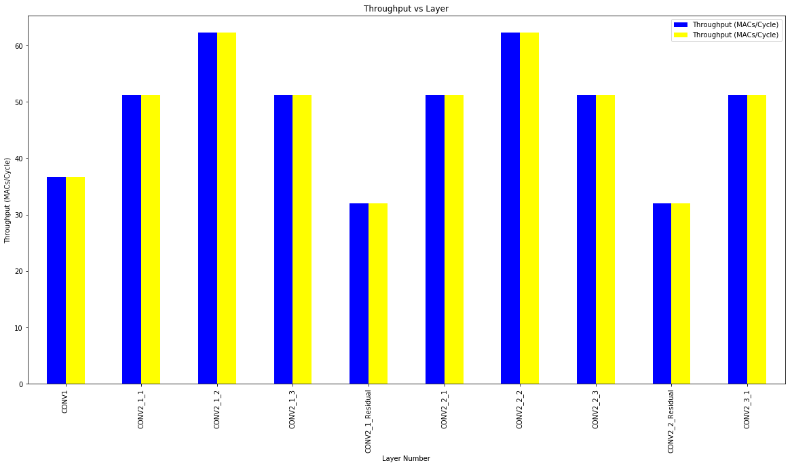

.. _Result Analysis:

Result Analysis with Jupyter Notebooks
========================================

.. note::
	This page was generated from maestro_output_analysis.ipynb. To interact with this **Jupyter Notebook** simply launch from here:

	.. image:: https://mybinder.org/badge_logo.svg
         :target: https://mybinder.org/v2/gh/smalik48/maestro_result_analysis/master

MAESTRO
~~~~~~~

-  An Open-source Infrastructure for Modeling Dataflows within Deep
   Learning Accelerators
   (https://github.com/georgia-tech-synergy-lab/maestro)

-  The throughput and energy efficiency of a dataflow changes
   dramatically depending on both the DNN topology (i.e., layer shapes
   and sizes), and accelerator hardware resources (buffer size, and
   network-on-chip (NoC) bandwidth). This demonstrates the importance of
   dataflow as a first-order consideration for deep learning accelerator
   ASICs, both at design-time when hardware resources (buffers and
   interconnects) are being allocated on-chip, and compile-time when
   different layers need to be optimally mapped for high utilization and
   energy-efficiency.

MAESTRO Result Analysis
~~~~~~~~~~~~~~~~~~~~~~~

-  This script is written to analyse the detailed output of Maestro per
   layer using various graphing techniques to showcase interesting
   results and filter out important results from the gigantic output
   file that the tool dumps emphasising the importance of Hardware
   Requirements and Dataflow used per layer for a DNN Model.

1 - Packages
------------

Let's first import all the packages that you will need during this
assignment. - `numpy <www.numpy.org>`__ is the fundamental package for
scientific computing with Python. -
`matplotlib <http://matplotlib.org>`__ is a library to plot graphs in
Python. - `pandas <https://pandas.pydata.org>`__ is a fast, powerful and
easy to use open source data analysis and manipulation tool

.. code:: ipython3

    %matplotlib inline
    import numpy as np
    import pandas as pd
    import matplotlib.pyplot as plt
    import import_ipynb
    from Util_graph import draw_graph

.. parsed-literal::

    importing Jupyter notebook from Util_graph.ipynb

2 - Reading the output file
---------------------------

Please provide the output file for your Maestro run to be read by the
script with the path relative to the script.

pd.read\_csv("name of your csv file")

As an example we are reading **Resnet50\_dla.csv**

.. code:: ipython3

    new_data = pd.read_csv('Resnet50_dla.csv')

2 - Creating Graphs
-------------------

Graphs can be generated by assigning values to the variables provided
below in the code.

The graphs are created by draw\_graph function which operates on the
variables provided below.

3- Understanding the Variables
------------------------------

-  x = "x axis of your graph"

   -  One can simply assign the column name from the csv to this graph
      as shown below in the code. Also, an alternate way is to select
      the column number from dataframe.columns. For example: for this
      case it will be new\_data.columns[1] that corresponds to 'Layer
      Number'.

-  y = "y axis of your graph"

   -  One can simply assign the column name from the csv to this graph
      as shown below in the code. Also, an alternate way is to select
      the column number from dataframe.columns. For example: for this
      case it will be new\_data.columns[5] that corresponds to
      'Throughput (MACs/Cycle)'.
   -  User can compare multiple bar graphs by providing a list to y.

-  color = "color of the graph"

-  figsize = "Controls the size of the graph"

-  Legend =" Do you want a legend or not" -> values (True/False)

-  title = "title of your graph"

-  xlabel = "xlabel name on the graph"

-  ylabel = "ylabel name on the graph"

-  start\_layer = "start layer that you want to analyse"

   -  a subset of layers to be plotted which are of interest. This
      variable allows you to do that.

-  end\_layer ="last layer that you want to analyse"

   -  a subset of layers to be plotted which are of interest. This
      variable allows you to do that. Please provide "all" if you want
      all the layers to be seen in the graph

.. code:: ipython3

    x = 'Layer Number'
    y = 'Throughput (MACs/Cycle)'
    color = 'blue'
    figsize = (20,10)
    legend = 'true'
    title = 'Throughput vs Layer'
    xlabel = x
    ylabel = y
    start_layer = 0
    end_layer = 'all'
    draw_graph(new_data, y, x, color, figsize, legend, title, xlabel, ylabel, start_layer, end_layer)

.. parsed-literal::

    <matplotlib.axes._subplots.AxesSubplot at 0x152d950c828>

.. code:: ipython3

    x = 'Layer Number'
    y = 'Activity count-based Energy (nJ)'
    color = 'red'
    figsize = (20,10)
    legend = 'true'
    title = 'Energy vs Layer'
    xlabel = x
    ylabel = y
    start_layer = 0
    end_layer = 'all'
    draw_graph(new_data, y, x, color, figsize, legend, title, xlabel, ylabel, start_layer, end_layer)

.. parsed-literal::

    <matplotlib.axes._subplots.AxesSubplot at 0x152d98bfdd8>

.. code:: ipython3

    x = 'Layer Number'
    y = 'Throughput Per Energy (GMACs/s*J)'
    color = 'green'
    figsize = (20,10)
    legend = 'true'
    title = 'Throughput per Energy vs Layer'
    xlabel = x
    ylabel = y
    start_layer = 0
    end_layer = 'all'
    draw_graph(new_data, y, x, color, figsize, legend, title, xlabel, ylabel, start_layer, end_layer)

.. parsed-literal::

    <matplotlib.axes._subplots.AxesSubplot at 0x152d99a49b0>

.. code:: ipython3

    x = 'Layer Number'
    y = ['Throughput (MACs/Cycle)', 'Throughput (MACs/Cycle)']
    color = ['blue','yellow']
    figsize = (20,10)
    legend = 'true'
    title = 'Throughput vs Layer'
    xlabel = x
    ylabel = 'Throughput (MACs/Cycle)'
    start_layer = 0
    end_layer = 10
    draw_graph(new_data, y, x, color, figsize, legend, title, xlabel, ylabel, start_layer, end_layer)

.. parsed-literal::

    <matplotlib.axes._subplots.AxesSubplot at 0x152d66e7c50>

